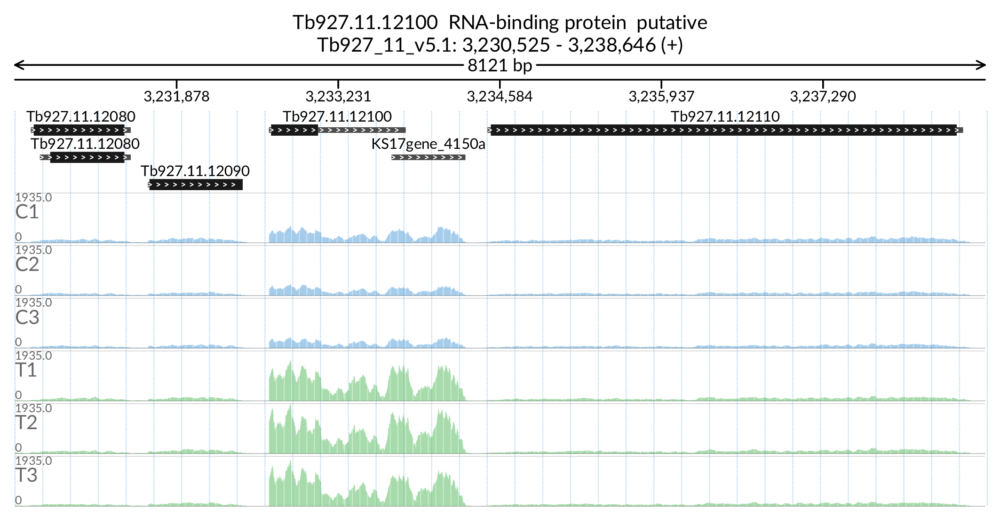

# RBP5

# A Kinetoplastid-specific RNA Binding Protein RBP5 cooperates with the transferrin receptor to maintain iron homeostasis in *Trypanosoma brucei*

## Affiliation
    Michele Tinti & Calvin Tiengwe

    Wellcome Centre for Anti-Infectives Research
    School of Life Sciences, University of Dundee
    

